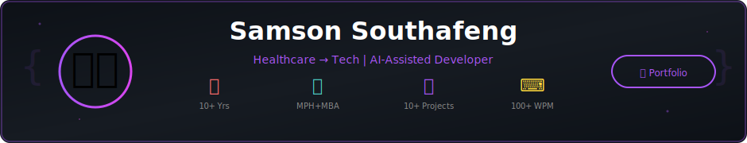

<!-- NEW -->
<p align="center">
  
</p>

---

## Hi, I'm Samson 👋

I'm a healthcare professional turned tech enthusiast with 5+ years of clinical experience working alongside physicians in high-pressure environments like the Emergency Department. Now I'm channeling that attention to detail into AI-assisted development.
Currently pursuing my MPH in Epidemiology and MBA in Finance & International Business, I'm passionate about building tech solutions that improve health outcomes and create wealth in underserved communities.
When I'm not coding with Claude as my co-pilot, you might find me geeking out over international relations or flexing my 150+ League of Legends champion knowledge 🎮

📍 Vancouver, WA | 🌐 [View My Portfolio](https://funnyvalentine69.github.io/samson_portfolio/)

---

## 💻 Skills

<table>
<tr>
<td style="width:50%;" width="760" valign="center">


</td>
<td style="width:50%;" width="500" valign="center">

<p align="center">
  <a href="https://git.io/awesome-stats-card">
    
  </a>
</p>

</td>
</tr>
</table>

---

## 🚀 Featured Projects

<table>
<tr>
<td style="width:50%;" width="700" valign="top">

### ☕ [Maid Cafe Dating Sim](https://github.com/FunnyValentine69/maid-cafe-dating-sim)

> AI-powered terminal dating game with dynamic NPC conversations

**Features:**
- 🤖 Local LLM integration for natural dialogue
- 🎭 Dynamic character personalities  
- 💬 Natural language processing
- 🎨 Rich terminal UI

**Tech Stack:** `Python` `Ollama` `Rich Library`

[](https://github.com/FunnyValentine69/maid-cafe-dating-sim)

</td>
<td style="width:50%;" width="500" align="center">


</td>
</tr>
</table>

---

## 💭 My Development Philosophy

<table>
<tr>
<td style="width:5%;" width="10" valign="center">

```python
class Developer:
    def __init__(self):
        self.background = ["Healthcare", "Business", "Public Health"]
        self.approach = "AI-Assisted Development"
        self.goal = "Build solutions that matter"
    
    def work_smarter_not_harder(self):
        """
        I don't just write code—I architect solutions 
        with AI as my pair programmer.
        The future of development is collaborative, 
        and I'm here for it.
        """
        while self.learning:
            self.leverage_ai_tools()
            self.ship_real_projects()
            self.iterate_and_improve()
        
        return "10x productivity achieved ✨"
```

</td>
<td width="1000" align="center">


</td>
</tr>
</table>

---

## 📡 Network & Socials

<p align="center">
  <a href="https://linkedin.com/in/samson-southafeng" target="_blank">
    
  </a>
  &nbsp;&nbsp;
  <a href="mailto:samson.southafeng@wsu.edu">
    
  </a>
