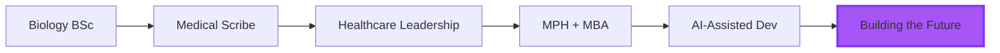

<p align="center">
  
</p>

<table width="100%">
<tr>
<td width="60%">
<h2>👋 Hey, I'm <span style="color:#A855F7;">Samson</span>!</h2>
  <ul>
    <li>🏥 <strong>Background:</strong> 5+ years in healthcare → MPH + MBA journey</li>
    <li>🤖 <strong>Philosophy:</strong> AI-Assisted Development & Smart Automation</li>
    <li>💡 <strong>Mission:</strong> Building 10+ portfolio projects to master modern dev workflows</li>
    <li>🎯 <strong>Focus:</strong> Healthcare Tech, FinTech, and Social Impact Solutions</li>
    <li>📍 <strong>Location:</strong> Vancouver, WA</li>
    <li>🌐 <strong>Portfolio:</strong> <a href="https://funnyvalentine69.github.io/samson_portfolio/">Check it out!</a></li>
    </ul>
    </td>
    <td width="40%" align="center">
      
    </td>
  </tr>
</table>

---

<table width="100%">
<tr>
<td>

## 🎓 My Unique Journey



**From Hospital to Code:** I've spent years documenting medical data under pressure, managing clinical workflows, and training healthcare teams. Now I'm channeling that precision, attention to detail, and systems thinking into software development—with AI as my force multiplier.

</td>
</tr>
</table>

---

<table width="100%">
<tr>
  <td valign="top" width="55%">
    
## 🛠️ Tech Arsenal

### Languages & Core


### AI-Powered Development


### Tools & Platforms


### Exploring


  </td>
  <td valign="top" width="45%">
    
## 📊 GitHub Stats

<div align="center">
  
  <br /><br />
  
  <br /><br />
  
</div>

  </td>
</tr>
</table>

---

## 🚀 Current Projects & Mission

<div align="center">

### **Building 10+ Portfolio Projects**
*Proving what's possible when human creativity meets AI efficiency*

</div>

### 🎮 Featured Project

<table width="100%">
<tr>
<td width="70%">

#### [☕ Maid Cafe Dating Sim](https://github.com/FunnyValentine69/maid-cafe-dating-sim)
> **AI-powered terminal dating game with dynamic conversations**

An experimental narrative game built with Python that demonstrates:
- 🤖 AI-driven NPC conversations using local LLMs
- 🎭 Dynamic character personalities and story branching
- 💬 Natural language processing for player interactions
- 🎨 Terminal-based UI with rich text formatting

**Tech:** Python, Ollama, Rich Library, JSON-based story engine

</td>
<td width="30%" align="center">
  
</td>
</tr>
</table>

### 🔮 Coming Soon

- 📊 **Healthcare Data Dashboard** - Visualizing public health trends with interactive charts
- 💰 **Personal Finance Tracker** - AI-assisted budgeting and expense categorization  
- 🏥 **Medical Terminology Quiz App** - Gamified learning for healthcare professionals
- 🌍 **Social Impact Platform** - Connecting underserved communities with resources

---

## 💭 My Development Philosophy

```python
class Developer:
    def __init__(self):
        self.background = ["Healthcare", "Business", "Public Health"]
        self.approach = "AI-Assisted Development"
        self.goal = "Build solutions that matter"
    
    def work_smarter_not_harder(self):
        """
        I don't just write code—I architect solutions with AI as my pair programmer.
        The future of development is collaborative, and I'm here for it.
        """
        while self.learning:
            self.leverage_ai_tools()
            self.ship_real_projects()
            self.iterate_and_improve()
        
        return "10x productivity achieved ✨"
```

### Why AI-Assisted Development?

- ⚡ **Speed:** What takes weeks alone takes days with AI co-pilots
- 🎯 **Focus:** Spend time on architecture and logic, not syntax
- 📚 **Learning:** Build while learning, iterate faster
- 🚀 **Innovation:** Experiment with ideas that would be too time-consuming otherwise

---

## 🌟 Skills Beyond Code

<table width="100%">
<tr>
<td width="50%">

### 🏥 Healthcare & Clinical
- Medical documentation & charting
- Clinical workflow optimization
- Healthcare data management
- Training & mentorship
- High-stress environment performance

</td>
<td width="50%">

### 💼 Business & Leadership
- Team training & development
- Process improvement
- Quality assurance
- Customer service excellence
- Project coordination

</td>
</tr>
</table>

---

## 🎯 What I'm Learning Right Now

- [ ] Advanced Python patterns and clean code architecture
- [ ] React and modern frontend development
- [ ] Database design and backend APIs
- [ ] LLM integration and prompt engineering
- [ ] DevOps basics (Docker, CI/CD)

---

## 📫 Let's Connect!

<p align="center">
  <a href="https://www.linkedin.com/in/samson-southafeng" target="_blank">
    
  </a>
  &nbsp;&nbsp;
  <a href="mailto:southafeng@gmail.com">
    
  </a>
  &nbsp;&nbsp;
  <a href="https://funnyvalentine69.github.io/samson_portfolio/" target="_blank">
    
  </a>
</p>

---

<div align="center">

### 💡 Fun Facts

🎮 Former League of Legends club president (memorized 150+ champions!)  
🌍 International relations enthusiast with global perspective  
🏥 MPH + MBA student bridging healthcare, business, and tech  
🤖 Believer in human-AI collaboration as the future of work

</div>

---

<p align="center">
  
</p>

<p align="center">
  <i>"The best way to predict the future is to build it—with AI as your co-pilot."</i>
</p>

---

<div align="center">
  <sub>Built with ❤️ using AI-assisted development | Last updated: January 2026</sub>
</div>
