<p align="center">
  
</p>

<p align="right">
  
</p>


---

## Hi, I'm Samson 👋

- 🏥 **Healthcare → Tech:** 10+ yrs clinical experience in high-pressure environments (ED, alongside physicians)
- 🎓 **Education:** MPH Epidemiology + MBA Finance & International Business
- 💻 **Building:** Trading systems, ML models, and AI applications in Python & R
- 🌍 **Based in:** Vancouver, WA
- 🎮 **Off-hours:** League of Legends enthusiast (150+ champs)
- 🔭 **Currently exploring:** Trading systems, AI applications & health data tools
- 🌐 [View My Portfolio](https://funnyvalentine69.github.io/samson_portfolio/)

<p align="center">
  
</p>

---

## 📈 Trading Systems

> Systems I've built for quantitative trading and market analysis

| Project | Description | Tech |
|---------|-------------|------|
| **Trading Companion** | Automated options signal system with real-time market scanning & mobile alerts | `Python` `SciPy` `pandas` `pytest` |
| **Trading Intelligence** | Multi-source market intelligence aggregator with scoring engine | `Python` `requests` `pandas` |
| **Options Trading Bot** | ML-powered options trading bot with live monitoring dashboard | `R` `tidymodels` `Shiny` `quantmod` |

---

## 🚀 Featured Projects

<table>
<tr>
<td style="width:50%;" width="700" valign="top">

### ☕ [Maid Cafe Dating Sim](https://github.com/FunnyValentine69/maidai-v1)

> AI-powered terminal dating game with dynamic NPC conversations

**Features:**
- 🤖 Local LLM integration for natural dialogue
- 🎭 Dynamic character personalities
- 💬 Natural language processing
- 🎨 Terminal-based gameplay

**Tech Stack:** `Python` `Ollama` `llama3.2`

[](https://github.com/FunnyValentine69/maidai-v1)

</td>
<td style="width:50%;" width="500" align="center">



</td>
</tr>
<tr>
<td style="width:50%;" width="700" valign="top">

### 🎙️ [MaidAI v3 — Sakura](https://github.com/FunnyValentine69/maidai-v3)

> Tsundere maid AI with voice chat and bilingual JP/EN dialogue

**Features:**
- 🗣️ Voice input via mlx-whisper (Apple Silicon optimized)
- 🎌 Bilingual JRPG-style dialogue (Japanese + English)
- 🎭 14 dynamic emotion expressions
- 🧠 Persistent conversation memory

**Tech Stack:** `Python` `Ollama` `Edge TTS` `mlx-whisper`

[](https://github.com/FunnyValentine69/maidai-v3)

</td>
<td style="width:50%;" width="500" align="center" valign="center">


</td>
</tr>
</table>

---

## 💻 Skills

**Languages**<br>


**ML / Data Science**<br>


**Trading / Finance**<br>


**Web / Frontend**<br>


**DevOps / Tools**<br>


**AI Tools**<br>


**Data Visualization**<br>


---

## 💭 My Development Philosophy

```python
class Developer:
    def __init__(self):
        self.background = ["Healthcare", "Finance", "Public Health"]
        self.approach = "Problem-Driven Development"
        self.goal = "Build solutions that matter"

    def work_smarter_not_harder(self):
        """
        From clinical triage to market signals—
        I build systems that turn data into decisions.
        Healthcare taught me to think under pressure,
        finance taught me to quantify risk.
        """
        while self.learning:
            self.identify_real_problems()
            self.ship_real_projects()
            self.iterate_and_improve()

        return "Real solutions, shipped ✨"
```

---

## 📡 Network & Socials 

<p align="center">
  <a href="https://linkedin.com/in/samson-southafeng" target="_blank">
    
  </a>
  &nbsp;&nbsp;
  <a href="mailto:taichou@wsu.edu">
    
  </a>
</p>
